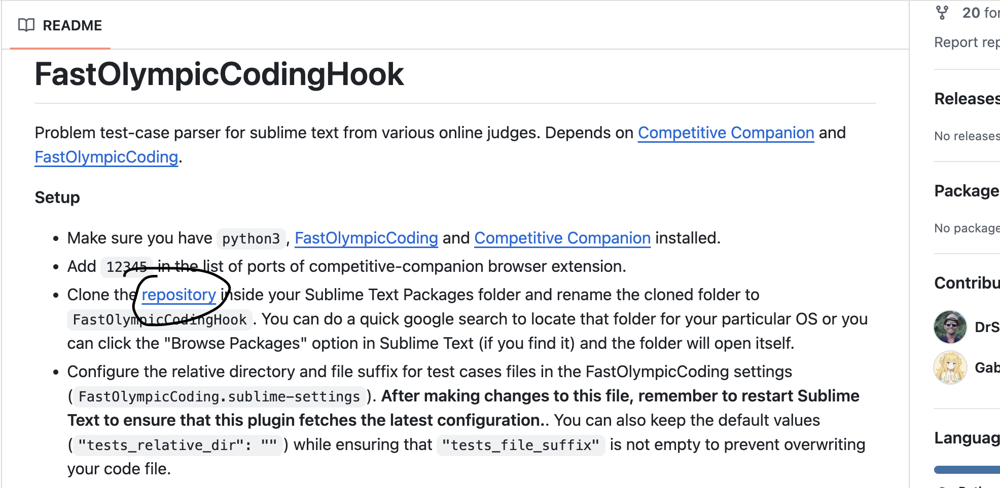
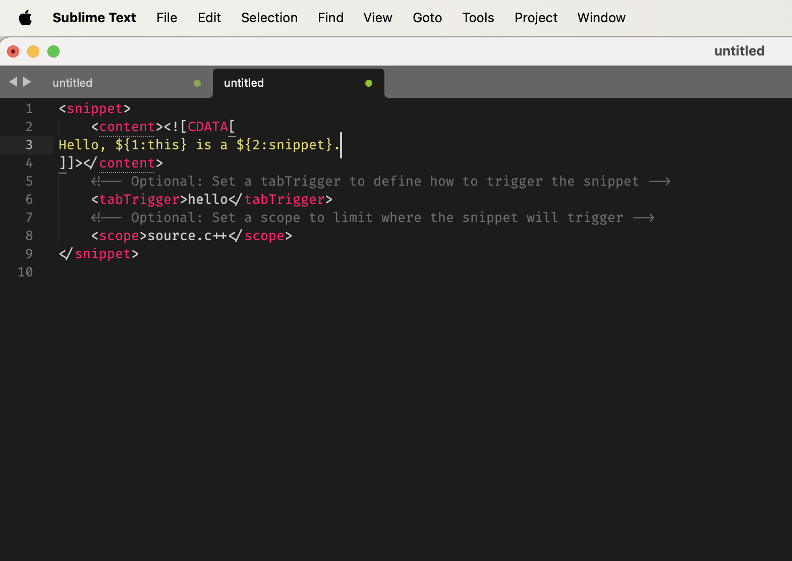

# Sublime Text配置C++

​	1、官网下载Sublime Text：https://www.sublimetext.com/

​	2、配置g++：对于Windows，需要下载g++，去github上下载：github.com/nixman/mingw-builds-binaries/releases，找到类似如下的下载即可（可能版本不同）：x86_64-15.2.0-release-win32-seh-msvcrt-rt_v13-rev0.7z，下载好之后将bin文件夹放在系统变量中，可以在powershell中输入G++ - v，有版本信息就可以了；对于MacOS，终端输入g++ -v，如果没有他会提示你下载，直接下载就可以了.

​	3、在Sublime中按ctrl+shift+p(Mac是command)，然后搜索pci，大概是package control install这几个英文单词就对了，回车安装，这个时候需要稍微等待一下，安装好会提示弹窗的.

​	4、下载fastolympiccoding： 还是ctrl+shift+p，调出来的就是刚才安装好的pci，搜索CppFastOlympicCoding安装就好了，这个好像没什么提示，再去搜索如果搜不到就证明安装好了，或者搜索Package Control: List Packages，可以查看已经安装的插件.

​	5、访问谷歌商店，搜索：Competitive Companion，添加到chrome，然后可以把该插件固定在浏览器右上角，这就是下面第七步说的绿色加号.

​	6、确保有python3的环境.

​	7、接下来需要下载浏览器右上角的绿色加号，用来爬取样例，先搜索：https://github.com/DrSwad/FastOlympicCodingHook，下滑就有这一步的操作教程了，也可以跟着本文继续往下操作.

​	8、右键绿色小按钮，点击选项，在Custom ports输入12345，下面的Request timeout可以选择设置为100.

​	9、如果是MacOS，打开终端，输入：open ~/Library/Application\ Support/Sublime\ Text/Packages/，回车；如果是Windows，在C盘，用户，用户名文件夹下找路径：C:\Users\\[用户名]\AppData\Romaing\Sublime Text\Packages\，其中，AppData文件夹是隐藏的.

​	10、点击如图链接，下载zip，解压后的文件夹移动到上述路径的文件夹下：



​	11、修改默认的c++11，改用20以上的版本：左上角Sublime Text -> Settings -> Package Settings -> FastOlympicCoding，右侧加入下列代码：

```
"run_settings": [
		{
			"name": "C++",
			"extensions": ["cpp"],
			"compile_cmd": "g++ '{source_file}' -std=gnu++2a -o {file_name}",
			"run_cmd": "./\"{file_name}\" {args} -debug",

			"lint_compile_cmd": "g++ -std=gnu++2a '{source_file}' -I '{source_file_dir}'"
		},
	],
"tests_file_suffix":"__tests"
```

​	12、ctrl+shift+p下载：Default File Type，然后需要添加一个文件，位置在：C:\Users\\[用户名]\AppData\Romaing\Sublime Text\Packages\User，如果是MacOS，可以利用第九步中的open方式，也可以在Sublime中左上角Sublime -> settings -> Browse Packages，即可看到User文件夹，就在User文件夹下新建文件，文件名为：default_file_type.sublime-settings，编辑文件如下：

```
{
"default_new_file_syntax": "Packages/C++/C++.sublime-syntax",
"use_current_file_syntax": false
}
```

​	然后重启Sublime.

​	13、编译快捷键：还是刚刚的Package文件夹，找到CppFastOlympicCoding在里面找对应系统的：Default(...).sublime-keymap，打开，滑倒最下方，修改两个run中的快捷键，熟悉的ctrl+b或者f5均可.

​	14、开启监听快捷键：设置或者preference中找到Key Bindings，打开，在右侧添加如下代码：

```
{ "keys": ["ctrl+shift+x"], "command": "fast_olympic_coding_hook" },
```

​	15、字体设置：Windows下：https://github.com/tonsky/FiraCode，下载好之后解压，安装；MacOS下：https://github.com/tonsky/FiraCode/releases，下载zip，解压，找到variable_ttf文件夹下的FiraCode-VF.ttf，双击安装即可.

然后在Sublime中找到settings，打开，右侧花括号中加入下面的代码：

```c++
"font_size": 13,
"font_face": "fira code",
```

​	字号根据自己需求设置即可.

​	16、字体主题设置：pci中搜索：monokai，下载好ctrl+shift+p，输入theme，选择安装好的主题就行了，这里下载好还需设置一下，打开步骤15中的修改代码位置，接着加上一行：

```
"color_scheme": "Packages/Monokai++/themes/Monokai++.tmTheme",
```

​	保存即可.

​	17、背景板透明度设置：Windows下：还是pci，搜索：Transparency，下载即可；MacOS下：暂时不知如何设置.

​	18、模板代码设置：Sublime上方找到Tools -> Developer -> new snippet，进去后页面设置如下：



​	黄色部分是你自己的模板代码，下方有个tabTrigger，中间的hello是关键字，输入回车即可将上方黄色模板代码搬出来，非常方便，将写好的该文件名保存为例如mycpptemplate+模板名之类的都可以，文件存放在第九步中涉及路径的Package下的User文件夹下.

​	19、一些其他注意事项：上述所有操作的前提是，利用ctrl+n或command+n来创建文件；在写完代码爬取样例测试时，需要先监听，也就是第14步的设置，确保光标在Sublime中，右键监听也行，设置的快捷键也行，监听之后，去题目网页，点击右上角的绿色加号，返回，ctrl+b编译就可以了，他会自动跑样例，如果各个test（如test0）是绿色的就说明通过该样例了，且这时不点击test0看不到样例，反之代码可能有错误；
